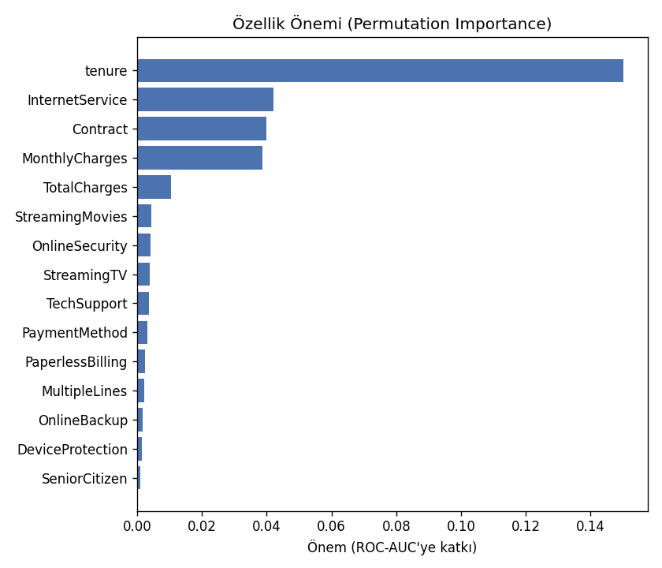
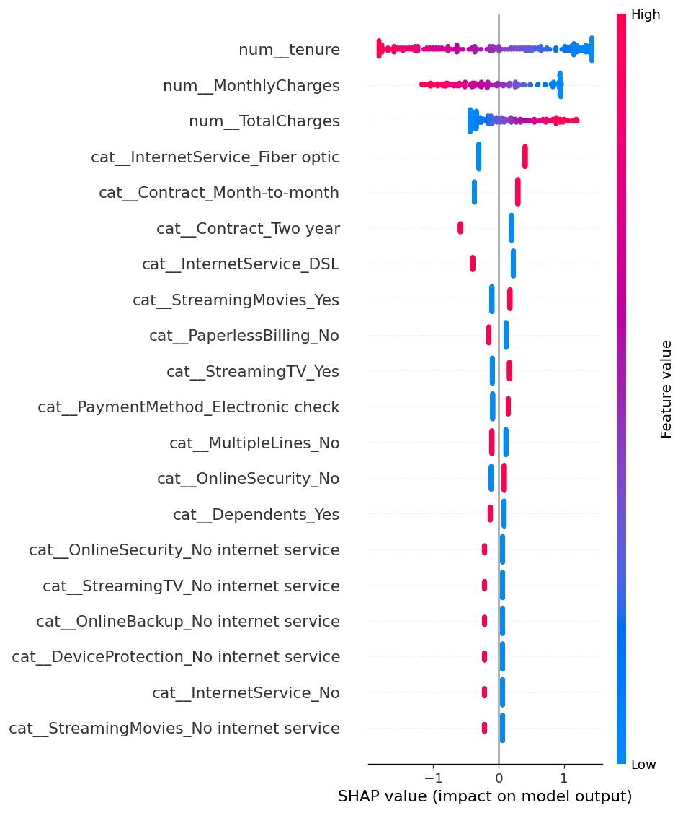
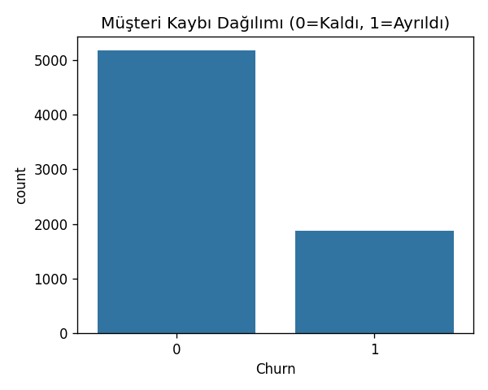
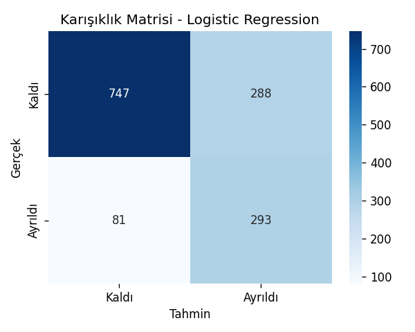

# 📉 Müşteri Kaybı (Churn) Tahmin Projesi

Telekom müşterilerinin **ayrılma (churn)** olasılığını makine öğrenmesiyle tahmin eden, uçtan uca bir veri bilimi projesi. Veri temizlemeden model eğitimine ve canlı bir web arayüzüne kadar tüm adımları içerir.


### 🔴 [Canlı Demo →](https://musteri-kaybi-tahmini-trsfj6r8l5vaok4dpeldat.streamlit.app)

> Uygulamayı kurmadan, doğrudan tarayıcından deneyebilirsin.

---

## 🎯 Problem

Telekom, banka, abonelik (Netflix/Spotify) gibi şirketlerde **yeni müşteri kazanmak, mevcut müşteriyi elde tutmaktan 5-7 kat daha pahalıdır.** Bir müşteri ayrıldıktan *sonra* fark etmek çok geçtir. Şirketin asıl ihtiyacı: "Hangi müşteri ayrılmak üzere?" sorusunu **önceden** yanıtlamak.

## 💡 Çözüm

Müşterinin geçmiş davranış ve sözleşme verilerini (kullanım süresi, sözleşme tipi, aylık ücret, ek hizmetler vb.) kullanarak **ayrılma olasılığını tahmin eden** bir sınıflandırma modeli. Böylece pazarlama ekibi, riskli müşterilere **henüz ayrılmadan** indirim/kampanya sunabilir.

## 📊 Sonuç

Birden çok model karşılaştırıldı ve en iyisi otomatik seçildi:

| Model | ROC-AUC | 5-katlı CV ROC-AUC | Recall |
|-------|:------:|:------:|:------:|
| **Logistic Regression** ⭐ | **0.841** | 0.845 ± 0.014 | 0.78 |
| Random Forest | 0.822 | 0.825 ± 0.012 | 0.48 |
| XGBoost | *(xgboost kuruluysa otomatik karşılaştırılır)* | | |

- En iyi sonucu **Logistic Regression** verdi (**ROC-AUC ≈ 0.84**).
- **5-katlı çapraz doğrulama (cross-validation)** sonucun şans eseri olmadığını doğruladı: düşük sapma = tutarlı model.
- Model, ayrılacak müşterilerin **~%78'ini** önceden işaretliyor (yüksek recall) — churn'de asıl önemli olan metrik budur.
- Sonuçlar, herkesin kullanabileceği bir **Streamlit web arayüzüne** döküldü.

> En etkili faktör **müşteri süresi (tenure)**; ardından **internet hizmeti tipi**, **sözleşme tipi** ve **aylık ücret** geliyor — düşük süreli, aya-dayalı sözleşmeli müşteriler en riskli grup.

### 💰 İş Etkisi (ROI)

Model sadece "doğru tahmin" yapmıyor, **para kazandırıyor**. Test seti üzerinde örnek bir hesap (müşteri yıllık geliri 1.000 TL, kampanya maliyeti 100 TL/kişi, kampanya başarı oranı %30):

> Bu varsayımlarla model, test setinde **~29.800 TL net kazanç** sağlıyor: "ayrılacak" dediği müşterilere kampanya yapmanın maliyeti çıkarıldığında bile, kurtarılan gelir daha yüksek. Rakamlar, Streamlit arayüzündeki **💰 İş Etkisi** sekmesinde slider'larla canlı değişir.

**Karar eşiği (threshold) optimizasyonu:** Model varsayılan olarak %50 eşik kullanır, ama bu her zaman en kârlı değildir. Arayüzde eşiği taradığımızda en kârlı noktanın **0.65** olduğunu ve net kazancı **~30.800 TL**'ye çıkardığını görüyoruz — yani makine öğrenmesi kararını doğrudan iş hedefine (kâr) göre ayarlıyoruz.

### 🔍 Açıklanabilirlik (Explainability)

Model bir "kara kutu" değil. İki yöntemle hangi faktörlerin kararı etkilediğini gösteriyoruz:

- **Permutation Importance** — genel olarak hangi özelliğin en önemli olduğu (global bakış).
- **SHAP** — her bir tahminde özelliklerin tahmini hangi yönde ittiği (detaylı bakış).

---

## 🖼️ Ekran Görüntüleri & Grafikler

> 📸 **Yapılacak:** Uygulamayı `streamlit run app.py` ile açıp ekran görüntüsü al, `grafikler/` klasörüne `uygulama.png` adıyla kaydet ve aşağıdaki satırın yorumunu kaldır:
> `<!--  -->`

**Model çıktıları (otomatik üretildi):**

| Özellik Önemi | SHAP Özeti |
|:---:|:---:|
|  |  |

| Churn Dağılımı | Karışıklık Matrisi |
|:---:|:---:|
|  |  |

📓 Detaylı keşifçi veri analizi (EDA) için: **[notebook.ipynb](notebook.ipynb)** — GitHub üzerinde doğrudan görüntülenebilir.

---

## 🗂️ Veri Seti

[Telco Customer Churn - Kaggle](https://www.kaggle.com/datasets/blastchar/telco-customer-churn) (ücretsiz, ~7.000 müşteri)

`WA_Fn-UseC_-Telco-Customer-Churn.csv` dosyasını indirip proje klasörüne koy.

---

## ⚙️ Kurulum

```bash
# 1. Depoyu klonla
git clone https://github.com/KULLANICI_ADIN/musteri-kaybi-tahmini.git
cd musteri-kaybi-tahmini

# 2. (Önerilir) Sanal ortam oluştur
python -m venv venv
venv\Scripts\activate        # Windows
# source venv/bin/activate   # Mac/Linux

# 3. Gereken paketleri kur
pip install -r requirements.txt
```

> 💡 **Not:** `xgboost` (~70 MB) opsiyoneldir. Yavaş bağlantıda inmezse sorun değil — proje Logistic Regression + Random Forest ile sorunsuz çalışır; `xgboost` kuruluysa 3. model olarak otomatik devreye girer.

---

## 🚀 Kullanım

```bash
# 1. Modeli eğit (grafikleri ve churn_model.joblib dosyasını üretir)
python train_model.py

# 2. Web arayüzünü başlat
streamlit run app.py
```

Tarayıcıda açılan arayüzde müşteri bilgilerini gir → **Tahmin Et** → ayrılma olasılığını gör.

---

## 🛠️ Kullanılan Teknolojiler

| Alan | Araç |
|------|------|
| Veri işleme | pandas, numpy |
| Görselleştirme | matplotlib, seaborn |
| Makine öğrenmesi | scikit-learn (Logistic Regression, Random Forest), **XGBoost**, 5-katlı cross-validation |
| Açıklanabilirlik | scikit-learn permutation importance, SHAP |
| Arayüz | Streamlit (4 sekme: Tahmin / Model Analizi / İş Etkisi / Toplu Tahmin) |
| Model kaydetme | joblib |
| Test & CI | pytest, GitHub Actions |

## 📁 Proje Yapısı

```
musteri-kaybi-tahmini/
├── train_model.py            # Veri işleme + model eğitimi + CV + açıklanabilirlik + ROI
├── app.py                    # Streamlit web arayüzü (4 sekme)
├── notebook.ipynb            # Keşifçi veri analizi (EDA) hikâyesi
├── requirements.txt          # Bağımlılıklar
├── README.md
├── LICENSE                   # MIT lisansı
├── tests/
│   └── test_model.py         # pytest testleri (CSV gerektirmez)
├── .github/workflows/
│   └── ci.yml                # GitHub Actions: her push'ta testleri çalıştırır
├── churn_model.joblib        # Eğitilmiş model (script çalışınca oluşur)
├── model_columns.joblib      # Form için sütun bilgisi
├── feature_importance.joblib # Özellik önemi skorları (arayüz kullanır)
├── business_metrics.joblib   # ROI için test metrikleri (arayüz kullanır)
├── test_predictions.joblib   # Threshold optimizasyonu için test olasılıkları
└── grafikler/                # Üretilen grafikler (script çalışınca oluşur)
    ├── churn_dagilimi.png
    ├── sozlesme_churn.png
    ├── aylik_ucret_churn.png
    ├── karisiklik_matrisi.png
    ├── feature_importance.png
    └── shap_summary.png
```

> Not: `.gitignore` dosyası `*.joblib` ve `grafikler/` klasörünü hariç tutar (GitHub'ı şişirmesin diye). Grafiklerini README'de göstermek istersen `.gitignore`'dan `grafikler/` satırını sil ve grafikleri commit'le.

---

## 👤 İletişim

Bu proje bir staj portföyü çalışmasıdır. Geri bildirime açığım!
